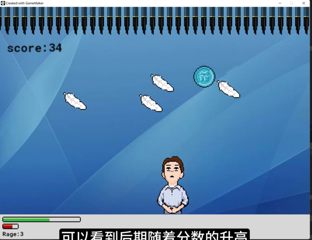

## background

根据 [【整活】我把李佳琦道歉视频做成了游戏-游戏日记02](https://www.bilibili.com/video/BV1F14y1k7FN/?spm_id_from=333.880.my_history.page.click&vd_source=9cb028fe6c978c6816626901d9249eb1)，我们对李佳琦小游戏产生了浓厚的兴趣，并打算做一个网页/小程序版的

目标效果（动画版）如下：



实际效果（v0.1）如下：


如果您也对该项目感兴趣，请加入我们！

具体请联系 wx: markshawn2020，请备注来意。

## roadmap

- [ ] 已经定义了几种用户吹的招式（类似王者荣耀），但目前只做了最基础的矩形，需要加入
  - 视觉效果
  - 更多技能模型
- [ ] 加入bgm与声音效果
- [ ] 支持双人模式（需要基于socket，目前只是mock了一个服务端（实际是跑在客户机的））
- [ ] 增量性能优化（目前是服务端50fps全量传输数据到客户端，实际应该可以基于animation之类的优化）

## notes

- 花西子眉笔的图片要事先处理好，包括角度、高度等，因为我们要使用 repeat 属性直接横向填充，而无法程序性修改
  - 建议要求
    - 高度为 64px、宽度为 16px、留白 2px 左右比较好
    - 笔尖方向朝下
  - 效果展示
    - 
- 在初始化李佳琦的位置时，我需要让他自动居中，
  - 一开始用了 `react-spring`库（配合`@use-gesture/react`），结果`react-spring`中的`useSpring`无法根据dependency（`width`）更新初始值，在component上无法有UI刷新效果
  - 换了 `framer-motion`后，它是用 `useEffect`更新初始值的，这个自然就顺利了
  - 让我生气的是，我当然可以用`useEffect`做，但你既然在`useSpring`里提供了`dependency`，缺用起来不符合预期，很难不怀疑包的质量！
  - 然后我看`framer-motion`里也提供了`gesture`相关的封装，我打算全部试用一下，看看有没有手势更好的实现，现在是要在`@use-gesture/react`里用`setInterval`我感觉很不方便
  - 但是在研究了 `framer-motion` 的 gesture 机制后，我感觉并不适合我们的目标，因为我们还是要实时地与 drag 时的位置进行数据交互的，我感觉 `framer-motion` 将其设计更多地用于了动画上，而不怎么关心数据，比如我随便一拖物体，它就会飘得很远，而且它底层是用 `translate` 实现的，我在这里 https://codesandbox.io/s/framer-motion-save-coords-after-drag-and-open-at-the-same-coords-eg6jnh?file=/src/App.tsx 找到了一份如何在 `onDragEnd` 时确定物体的位置，我认为这种与 element 的实际位置脱钩的方式不适合我们项目。另一个严重的问题，似乎 framer 在一直刷新UI，可能是我的hook写的有问题？然后导致电脑发热了，这在 use-react-gesture 里是没有这个问题的。具体参考：https://www.framer.com/motion/gestures/
  - 基于 framer-motion 的这种设计问题，我还是决定用回 `use-react-gesture` 与 useSpring （使用 useEffect去更新初始数据）
- 关于蓄力与移动这个的问题，比较简单粗暴地就是直接使用interval不断刷新游戏，而不要用响应式的，代码会比较麻烦
  - 这样我们就可以统一地在 interval 里处理逻辑
- trpc with nextjs13
  - https://github.com/wpcodevo/nextjs13-trpc-setup/blob/main/src/app/layout.tsx
- zod with zod-prisma-type
  - `yarn add zod@\<=3.21.1`, see: https://github.com/colinhacks/zod/issues/2184#issuecomment-1573154480
- audio
  - 选型
    - 先用 `react-audio`，结果官方case对hook不友好，而且`Audio.status.Playing`没有此变量
    - 接着用了 `use-audio`，这个不错
  - bug
    - The AudioContext was not allowed to start. It must be resumed (or created) after a user gesture on the page.
    - 这个bug说明音乐播放需要主动去点击，正好我们有按钮（开始游戏），所以没问题
    - ```javascript
      // 当游戏开始后正式开始音乐
      state === "playing" &&
      // 基于web规定，在用户没有操纵网页之前，无法自动播放音乐
      triggered &&
      // 在音乐没有加载之前，播放会失效，导致没有音乐
      durationStart
      ```
  - sources
    - game-start: 
      - [超级玛丽里城堡部分的游戏音乐配乐素材下载_mp3格式背景音乐_熊猫办公](https://www.tukuppt.com/muban/lkyjejbp.html)
    - game-end:
      - 超级玛丽 游戏_配乐_背景音乐_bgm 免费下载 - 爱给网, https://www.aigei.com/music/game/super_mario
  - todo
    - 还不知道 resume 怎么写
- 屏蔽放大镜
  - 找遍全网（1-2小时），最终答案是在`touchEnd`，参考： https://stackoverflow.com/a/75872162/9422455
- 旋转金币
  - coin-1
    - 最酷炫，改了自己的图片
    - CSS3实战：实现一个旋转的3D金币 - 掘金, https://juejin.cn/post/6965372708905287717
  - coin-2
    - 不太好看
  - coin-3: 8bit bitcoin
    - 用keyframe写的，最流畅，但是不知道怎么改大小
- 闪屏问题
  - 一开始以为是interval里有两个不同的set导致的，然后合并成了一个，结果还是闪
  - 接着以为是有些图片的比例没有调好，把所有warning都修好了（基于fill、w-full/h-auto之类），结果还是闪
  - 最后慢慢观察，只要不操作就不闪屏，操作的时候憋气时会闪，考虑到图片是动态的，因此明确其实是动态图片加载导致的问题